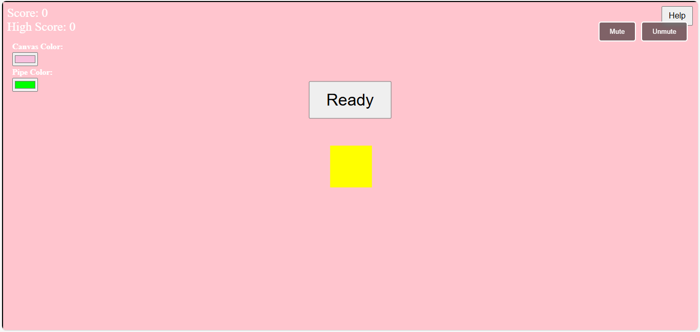
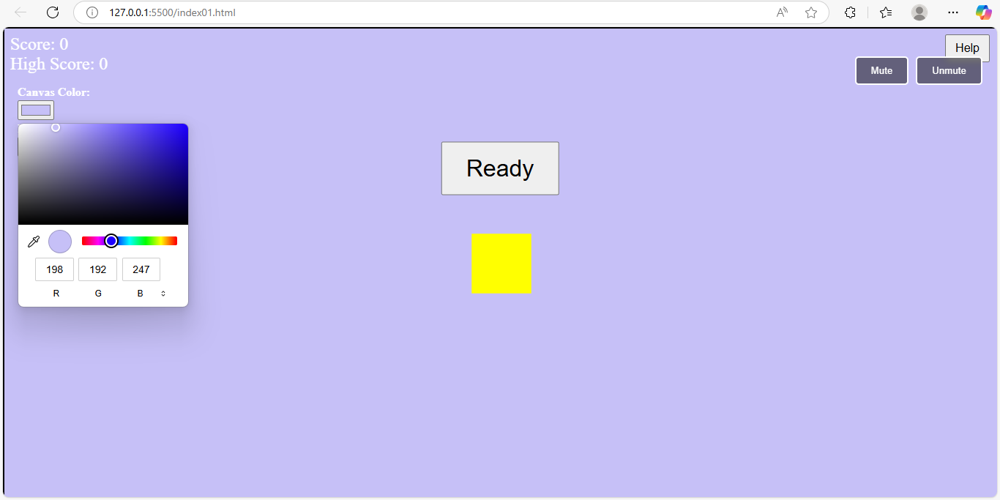

# 🐦 Flappy Bird Game - Vanilla WebGL

A simple, interactive Flappy Bird-style game built using **vanilla WebGL** (no frameworks). The game features customizable background and pipe colors, a mute/unmute button, a help overlay, and a countdown before the game begins.

## 🚀 Features

- 🎮 Gameplay: Navigate a square bird through moving pipes.
- ⏳ Countdown: "Ready... 3, 2, 1, Go!" before the game starts.
- 🎵 Music Controls: Mute and unmute background music.
- 🎨 Color Customization: Change background and pipe colors using color pickers.
- ❓ Help Button: Displays game instructions in a modal overlay.
- 💥 Game Over Screen: View score and restart the game.

---

## 🧱 Built With

- **WebGL (Vanilla)** – For rendering bird, pipes, and background.
- **HTML & CSS** – For UI components and overlays.
- **JavaScript** – For game logic, controls, and interactions.
- **Web Audio API** – For background music and mute/unmute functionality.

---

## 📦 Project Structure
### flappy-bird-webgl/
- **index.html** # Main HTML file
- **style.css** # UI styling
- **main.js** # Game logic, rendering, input
 ### shaders/
- **vertex.glsl** # Vertex shader
- **fragment.glsl** # Fragment shader
### assets/
- **background.mp3** # Background music

---

## ▶️ How to Play

1. **Press Spacebar** or **Click** to make the bird jump.
2. Avoid pipes – touching one ends the game.
3. Pass through as many pipes as possible to increase your score.

---

## 🛠️ Controls

| Button        | Function                |
|---------------|-------------------------|
| ⏸ Help        | Show how to play        |
| 🔊 Mute/Unmute | Toggle background music |
| 🎨 Color Pickers | Customize background and pipe colors |
| 🔄 Restart     | Start a new game        |

---

## 📋 To Run Locally

1. Open `index01.html` in a browser:

---

## 📸 Screenshots

### 🕹️ Gameplay Screen

### 🎨 Customization Screen

---

## 📅 Future Improvements

- Add mobile/touch support
- Animate the bird's flap
- Add background textures or themes

---

## 📄 License

This project is licensed under the [MIT License](LICENSE).

---

## 🧑‍💻 Author

**Phindiwe Gxathwane**  
Feel free to reach out via GitHub or contribute to this project!

